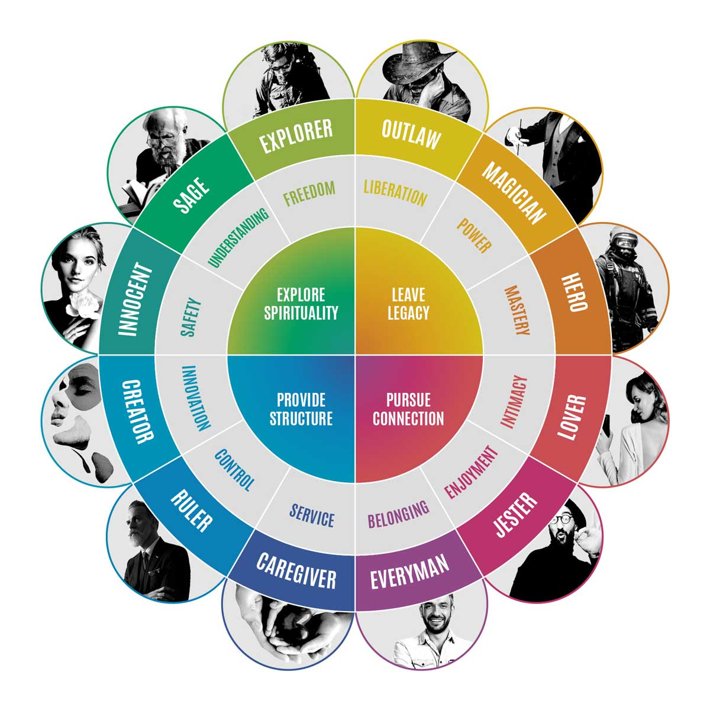

# The Brand of Thomas Vivas
I looked at the different brand archetypes there are

*Image from  https://iconicfox.com.au/brand-archetypes/*
and by iterating through the different options and asking "does this sound like me?" I came to the conclusion that outlaw fit me best.
My thought process will be explained as I looked at each category of archetype and the archetypes themselves:
## Leave Legacy
1. **Outlaw** (liberation) - This is the very first thing that caught my eye, not just because it's at the top of the chart, but because it hit me at my essence. Back in high school I used to be a straight up bot—not making any sort of opinions, art, or action. I've been sick of this for a while and I could feel something trying to scratch out from inside of me. With the advent of my university attendance, I finally had a window to shine. I grew more contrarian and embraced self-expresion to an unprecedented degree. I did not want to remain homogenous with the crowd. I wanted my heart to be viewed upon and be part of the other hearts in this world.
2. **Magician** (power) - The meaning of this archetype eludes me, but it does not speak to me. Some form of performance may be involved as it's in the *leave legacy* section, perhaps by demonstrating power in a form that seems like magic to others. Only the cream of the crop may be able to do this. 
3. **Hero** (mastery) - 
## Pursue Connection
4. **Lover** (intimacy) - Love has not been a part of my life in a huge way. I mainly kept to myself but alongside with 
5. **Jester** (enjoyment) - 
6. **Everyman** (belonging) - 
## Provide Structure
7. **Caregiver** (service)
8. **Ruler** (control)
9. **Creator** (innovation)
## Explore Spiritiuality
10. **Innocent** (safety)
11. **Sage** (understanding)
12. **Explorer** (freedom)

There's a whole lotta stuff in here honestly ough I don't need that much. Sayonara!
